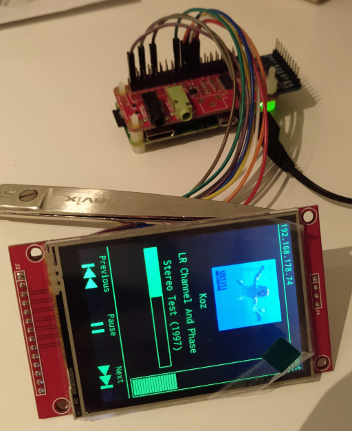

# Mini Fuzz

This is an ongoing project to build a standalone table-top music player with headphone output.

## Goals

- Be standalone – A device to play my music and do nothing else
- Be small (in physical size) – A device that fits onto my desk without occupying much space
- Be big (in storage size) – A device that contains _all_ my music
- Be old-school – A device with mechanical controls for enjoyable operation

## Components

- Raspberry Pi Zero W
- JustBoom DAC Zero pHAT
- ILI9341 240x320 RGB TFT LCD display
- ADS1115 ADC
- Slider potentiometer

## Current State

- [ ] Physical components
  - [x] Stacking header soldering
  - [x] DAC pHAT stacking
  - [x] Display wiring
  - [ ] Button wiring
  - [x] ADC & volume slider wiring
  - [ ] Rotary encoder wiring
  - [ ] Case
- [ ] Control reading
  - [x] Volume slider
  - [ ] Play / pause / previous / next buttons
  - [ ] Power button
- [ ] UI
  - [x] Playback screen
     - [x] Current track info (artist, album, title)
     - [x] Cover view
     - [x] Track progress bar
     - [x] Volume meter
     - [x] Playback controls
  - [ ] Library screen
  - [ ] Playlist screen
  - [x] Screen transitions
- [ ] Other
  - [ ] Allow MPD idling to be interrupted by command



## Wiring

```
ADS1115 ADC | Raspberry Pi (Physical Pin)
------------+-----------------------------
VDD         | 17
GND         |  9
SCL         |  5
SDA         |  3
ADDR        |  -
ALRT        |  -
A0          |  Slider Pot OTA
A1          |  -
A2          |  -
A3          |  -
```

```
Slider Pot | Raspberry Pi (Physical Pin) | ADS1115 ADC
-----------+-----------------------------+-------------
OTA        |  -                          | A0
VCC        | 17                          |  -
GND        | 39                          |  -
```

```
ILI9341 Display | Raspberry Pi (Physical Pin)
----------------+-----------------------------
SOCK (MISO)     | 21
LED             | 10
SCK             | 23
SDI (MOSI)      | 19
DC              | 18
RESET           | 22
CS              | 24
GND             |  6
VCC             |  1
```

```
               ┌───────────────────────────┐
               │┌─────────────────────────┐│
               ││┌───────────────────────┐││
               │││┌─────────────────────┐│││
╔═══════╗      ││││  ╔═════════╗        ││││  ╔══════════════╗
║  VDD ─╫─────┐│││└──╫─ 01 02 ─╫─x      ││└│──╫─ SOCK (MISO) ║
║  GND ─╫────┐││││┌──╫─ 03 04 ─╫─x ┌────││─│──╫─ LED         ║
║  SCL ─╫────││││││──╫─ 05 06 ─╫───│───┐││ └──╫─ SCK         ║
║  SDA ─╫────│││││┘x─╫─ 07 08 ─╫─x │   ││└────╫─ SDI (MOSI)  ║
║ ADDR ─╫─x  └││││───╫─ 09 10 ─╫───┘┌──││─────╫─ DC          ║
║ ALRT ─╫─x   ││││ x─╫─ 11 12 ─╫─x  │┌─││─────╫─ RESET       ║
║   A0 ─╫───┐ ││││ x─╫─ 13 14 ─╫─x  ││┌││─────╫─ CS          ║
║   A1 ─╫─x │ ││││ x─╫─ 15 16 ─╫─x  │││└│─────╫─ GND         ║
║   A2 ─╫─x │ ├│││───╫─ 17 18 ─╫────┘││ └─────╫─ VCC         ║
║   A3 ─╫─x │ │││└───╫─ 19 20 ─╫─x   ││       ╚══════════════╝
╚═══════╝   │ ││└────╫─ 21 22 ─╫─────┘│       ILI9341 Display
ADS1115 ADC │ │└─────╫─ 23 24 ─╫──────┘
            │ │    x─╫─ 25 26 ─╫─x
            │ │    x─╫─ 27 28 ─╫─x
            │ │    x─╫─ 29 30 ─╫─x
            │ │    x─╫─ 31 32 ─╫─x
╔══════╗    │ │    x─╫─ 33 34 ─╫─x
║ OTA ─╫────┘ │    x─╫─ 35 36 ─╫─x
║ VCC ─╫──────┘    x─╫─ 37 38 ─╫─x
║ GND ─╫─────────────╫─ 39 40 ─╫─x
╚══════╝             ╚═════════╝
Slider Pot           Raspberry Pi /
                     DAC Zero pHAT
```

## License

Mini Fuzz is licensed under the GNU General Public License as published by the Free Software Foundation, either version 3 of the License, or (at your option) any later version.

The Inconsolata font is subject to the Open Font License.
